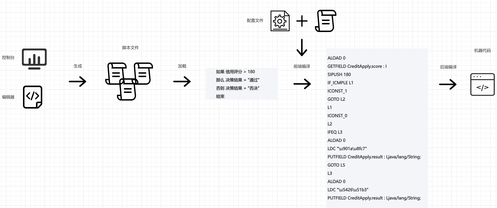
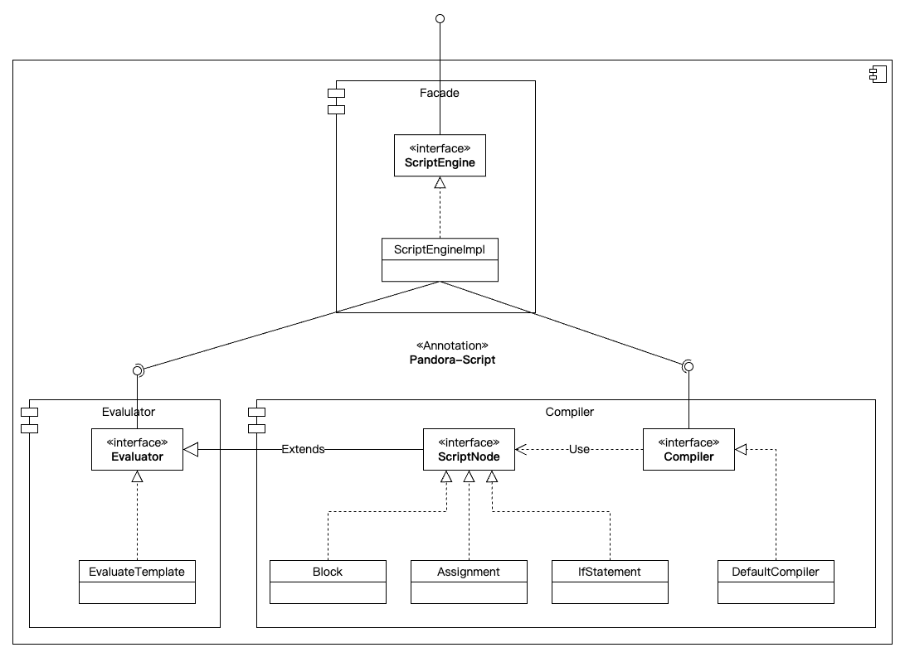
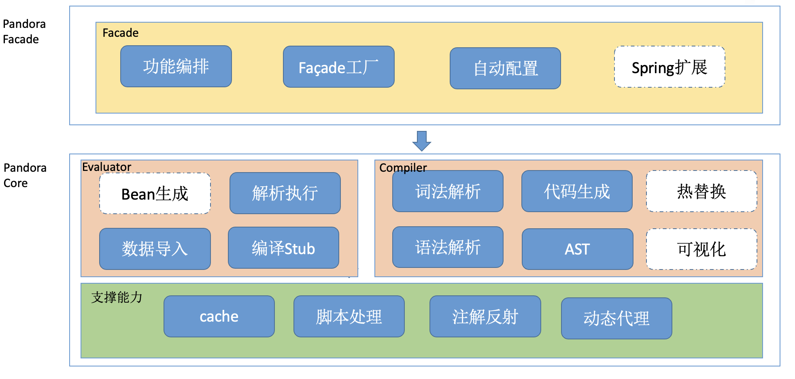
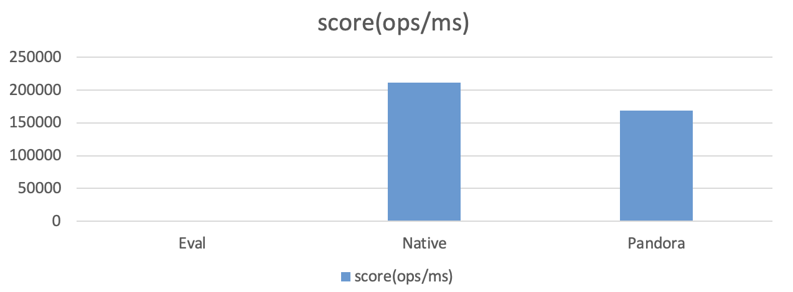

## 项目简介
Welcome to Pandora World! 一个把规则表达式脚本进行AST转换后生成Jvm字节码的简易编译工具。其执行速度是解析执行的 **1000** 多倍，可以达到原生java代码执行效率的 **80** %左右！挑战性能之巅！

## 背景问题
此编译工具诞生于风控平台中的决策引擎，主要是为了解决传统决策引擎使用动态类型脚本进行解析执行时性能较慢的问题。

当我们在项目中把一段风控规则从C++应用迁移到Java实现的决策引擎应用中去时，发现决策引擎处理规则的响应时间远远高于C++应用，性能下降了上百倍，我们从决策引擎的执行过程分析中发现，它把策略人员开发的规则脚本转换成动态类型脚本进行解析，生成对应的AST，然后对其进行解析执行，其过程中生成大量的中间值，占用不少的内存，同时简单的计算指令也要经过多次函数调用才能完成，其性能自然大幅降低。如果我们能够把动态类型脚本进行类型静态化，同时对其进行编译后执行对应的字节码，那么其性能肯定会有所提升。

## 动态脚本静态化
在大部分可以预先知道规则所使用的数据的类型情况下，可以预先定义好数据类型并和脚本结合，达到数据类型的静态化，提升“动态”脚本的执行效率。

在各种业务场景中，经常会遇到需要对业务规则进行灵活调整的"重规则"场景，无论是在风控类场景，还是在营销类场景，又或者在审批类场景，都经常遇到规则的频繁调整， 如果把对应的业务规则编码在应用中，则无法动态灵活地对其进行响应，特别是在大数据大模型的风控决策场景中更甚。在风控场景中，开发团队通常会划分出三种角色，策略运营、数据算法和应用开发，分别对策略规则进行开发，对数据进行特征清洗和模型进行训练，对风控平台应用功能进行开发。所以对策略运营人员提供的规则脚本编辑功能应该尽量屏蔽技术开发的细节，例如函数的定义、变量的声明、数组的使用等等，避免对策略运营人员造成技术认知负担，所以后台开发人员一般会优先考虑使用策略运营人员更容易理解的动态类型脚本来提供规则的开发能力，因为动态类型不需要进行变量类型申明，同时只要不提供数组和函数的相关功能，则可以对策略运营人员做到技术透明。但是动态类型脚本需要在运行时进行类型判断，这样增加了规则逻辑的计算量，必然会带来一定的性能损耗。我们让开发人员进行数据类型定义，屏蔽掉技术细节，而让策略人员专注于规则编写，最终两者结合在一起运行，以达到减少动态类型判断的计算量。

## 编译执行
在获取到数据的类型后，可以将动态类型规则脚本进行静态编译，进而转换成Jvm的字节码，转交给Jvm进行执行，避免脚本解析执行带来的性能损耗。

传统的规则引擎(包括决策引擎)基本都使用解析执行来实现动态类型脚本的运行，无论是通过把脚本解析成一串指令集然后执行指令集对应的代码(也就是Instruction Dispatch)，还是通过直接生成AST然后深度遍历AST来执行对应的代码(也就是AST Walking)，都需要产生很多的中间过程值，对运行内存造成一定的压力，同时由于解析执行的本质是使用一套模版代码来适配万千不同的脚本代码，无论是基于指令分派还是AST遍历都涉及了函数调用，特别是这种高频次的函数调用，其调用成本甚至远超过了函数内部的代码执行成本，结果自然是使得整体代码执行效率低下。Java函数调用的开销到底有多高呢？Jvm字节码采用分层编译的方式，即可以运行在解析执行的模式下，也可以运行在编译执行的模式下，也就是说，规则脚本即使被编译成Jvm字节码，也还是要经过Jvm的解析执行和编译执行，在编译执行模式下的Jvm字节码，在通过virtual invoke指令进行函数调用时，都需要进行上下文保存，把寄存器上的值保存到线程栈上，转而调用Jvm自己的实现代码进行调用目标的解析(这里有点类似于协程切换的方式从Java代码执行切换到Jvm代码执行)，如果目标Class未加载，则进行加载连接，进而解析出目标函数的调用地址，虽然可以对目标函数进行静态绑定(在满足单一派生等条件下)，减少每次进行调用目标解析的成本，但是整体函数调用的开销还是比较高的，特别是目标函数的实现逻辑比较简单的情况下，函数调用的开销更是不可忽视。

更有甚者，"指令派发"这种通过循环方式(经典冯•诺依曼体系中的FDX循环方式)进行指令执行和"AST遍历"这种通过递归方式进行函数调用的实现基本无法进行函数内联，而函数内联是编译器优化的基石，是提供更加深度优化(如常量传播、复制传播、死代码消除、循环展开、值编号优化等等)机会的前提，解析执行的实现方式减少了后期可能的编译优化机会，让原本简单可优化的代码逻辑只能按部就班地执行，这跟可以享受编译优化的实现方式对比在性能上又降低了不少。虽然Jvm采用分层编译的方式运行，一开始对字节码也是进行解析执行，但经过多次采样达到阈值后最终会把字节码编译成机器代码进行编译执行，机器代码基于寄存器执行CPU指令集，比基于内存堆栈执行解析指令的速度更快，特别是经过编译器优化后的指令可以充分利用寄存器来减少寄存器和内存之间的读写交互。

## 方案说明

### 方案流程



* 可以通过有交互页面的控制台来开发规则脚本，也可以使用编辑器来手写开发规则脚本
* 脚本文件首先被加载到内存，然后通过配置文件把脚本内容和数据类型定义进行绑定
* 对绑定后的脚本进行前端编译，生成对应的Jvm字节码
* Jvm对字节码进行后端编译以及优化，生成对应的机器代码

### 模块设计图


Pandora Script内部主要划分为Facade、Compiler和Evaluator三大模块：
* 外部通过Facade模块的ScriptEngine接口和Pandora Script进行交互
* Compiler模块主要负责把脚本代码解析成AST和生成对应的Jvm字节码
* Evaluator模块主要负责通过AST解析执行脚本代码，同时提供一个Stub方便调用动态生成的Jvm字节码(编译执行)

### 架构设计图


注意图中含有用虚线标注的未实现的模块，未来规划落地中

### 性能测试结果

```text
OS:  Darwin MC3 23.6.0 Darwin Kernel Version 23.6.0:RELEASE_ARM64_T6030 arm64
CPU: Apple M3 Pro
Benchmark                     Mode  Cnt        Score   Error   Units
ScriptBenchmark.testBaseline  thrpt       3954801.951          ops/ms
ScriptBenchmark.testEval      thrpt           159.004          ops/ms
ScriptBenchmark.testNative    thrpt        211442.518          ops/ms
ScriptBenchmark.testPandora   thrpt        168746.103          ops/ms
```



说明:
* testBaseline 为机器性能基准测试结果
* testEval 为解析执行测试结果
* testNative 为纯原生java代码执行测试结果
* testPandora 为编译执行测试结果

注意，为了减少编译器优化带来的影响，特意关闭了内联优化，编译执行可以达到原生java代码执行效率的80%左右

#### 性能测试脚本示例
```java
@Warmup(iterations = 1, time = 5, timeUnit = TimeUnit.SECONDS)
@Measurement(iterations = 1, time = 5, timeUnit = TimeUnit.SECONDS)
@Fork(1)
@BenchmarkMode(Mode.Throughput)
@OutputTimeUnit(TimeUnit.MILLISECONDS)
@State(Scope.Benchmark)
public class ScriptBenchmark {

    private ParseTree tree;

    private EvalTemplate template;

    private EvalVisitor visitor;

    @Benchmark
    public void testBaseline() {
    }

    @Benchmark
    public void testEval() {
        visitor.visit(tree);
    }

    @Benchmark
    @CompilerControl(DONT_INLINE)
    public Object testNative() {
        Model model = new Model();
        return invoke(model);
    }

    public Object invoke(Object o) {
        Model model = (Model) o;
        model.int1 = 666;
        model.int2 = 879;
        model.float1 = 12.34f;
        model.float2 = 13.44f;
        model.name1 = "my peter";
        model.flag1 = model.int1 >= model.int1;
        model.flag2 = model.float1 > model.int2;
        model.double1 = (model.float1 + model.float2) * model.int1;
        model.float3 = (model.float1 + model.float2) * model.int1;
        model.int1 = model.int1 * (model.int1 + model.int2);

        if(model.int1 < 100 || model.flag1)
            model.int3 = 100;
        else if (model.int1 > 800)
            model.int3 = 10;
        else if (model.int1 > 600)
            model.int3 = 1000;
        else
            model.int3 = 1;

        model.int2 = 0;
        while(model.int2 < 10)
            model.int2 = model.int2 + 1;

        return o;
    }

    @Benchmark
    @CompilerControl(DONT_INLINE)
    public Object testPandora() {
        Model model = new Model();
        return template.eval(model);
    }

    public static void main(final String[] args) throws Exception {
        Options opt = new OptionsBuilder().include(ScriptBenchmark.class.getSimpleName())
                .build();
        new Runner(opt).run();
    }
}
```

## 使用文档
待补充